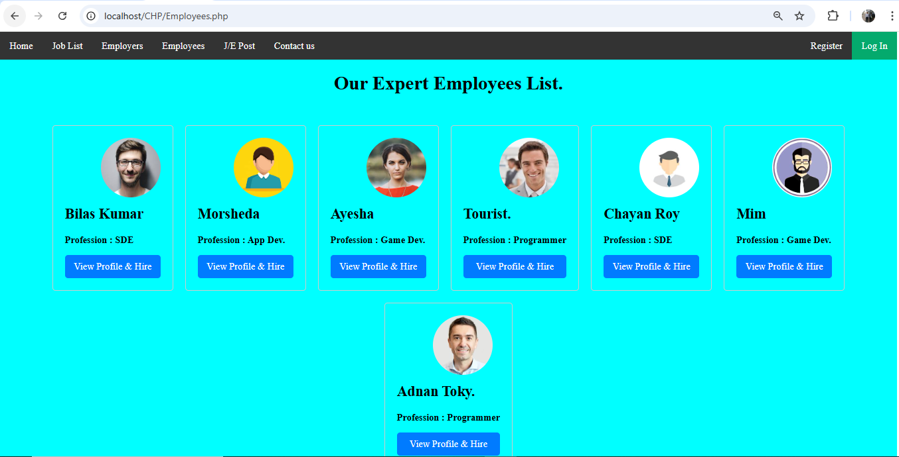
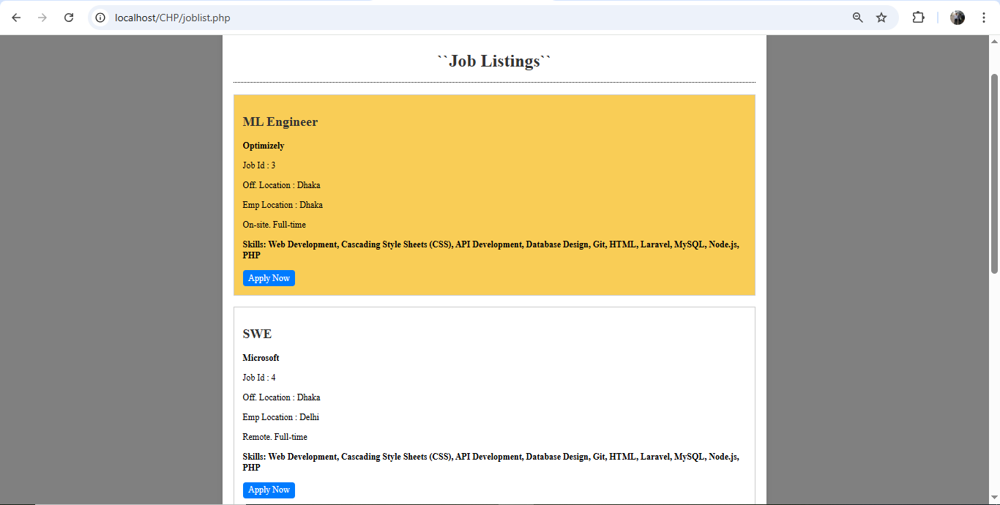
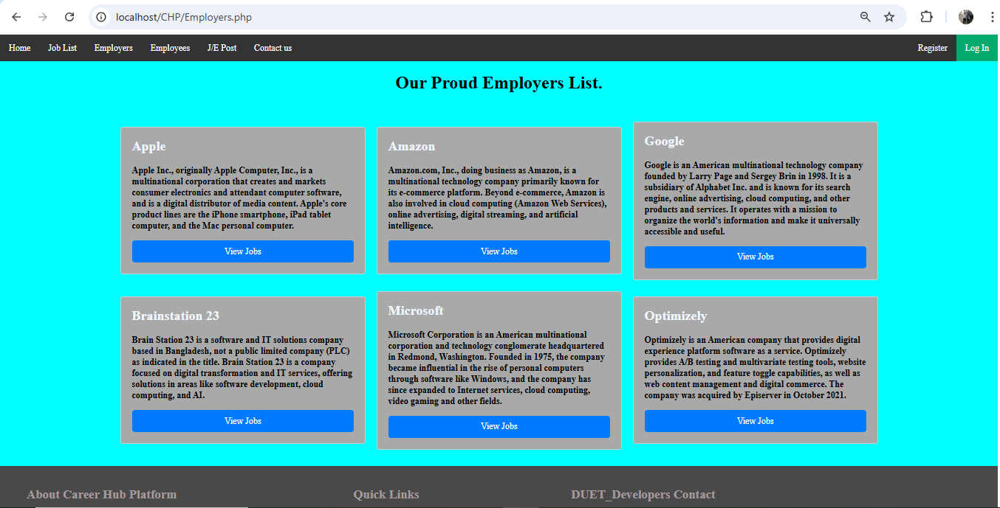

# Career Hub Platform 🚀
Career Hub Platform is a social networking website for professionals to connect with each other, find jobs, and stay up-to-date on industry news. Anyone can search for job related to his/her profession and anyone can hire expert employee for his work

## 📌 Features
### 👨‍💼 Employees (Job Seekers)
   - Register and create an account with professional skills and experience.
   - Build a detailed employee profile showcasing skills, portfolio, and experience.
   - View available job listings that match registered skills.
   - Apply directly to relevant job posts.
   - Explore a list of registered companies (employers) and manually search for jobs matching personal skills.
   - Update and maintain employee profiles for better hiring opportunities.

### 🏢 Employers (Companies)
   - Register and create a company account with location and basic details.
   - View a list of expert available employees filtered by skills.
   - Post new job circulars targeted towards skilled employees.
   - Review detailed employee profiles before proceeding with hiring decisions.
   - Hire employees directly through the platform based on skills and experience.
     
### ✨ Common Platform Features
   - Secure login and account management for both employees and employers.
   - Skill-based job matching system for higher accuracy.
   - Company-specific employee search and job discovery.
   - Interactive profiles to showcase or evaluate skills before job application or hiring.

## 🖼️ Screenshots
#### Some screenshots of my project are shown below.
 
 

## ⚡ Installation
#### How to set up the project locally: 
 1. Clone the repository.
 2. Create a MySQL database and import the provided SQL file located in db folder.
 3. Configure the database connection in the PHP files.
 4. Run the application using a local server (e.g. XAMPP)

## 🛠️ Technologies Used
   - PHP
   - MySQL
   - HTML5, CSS3, JavaScript
   - Bootstrap
     
